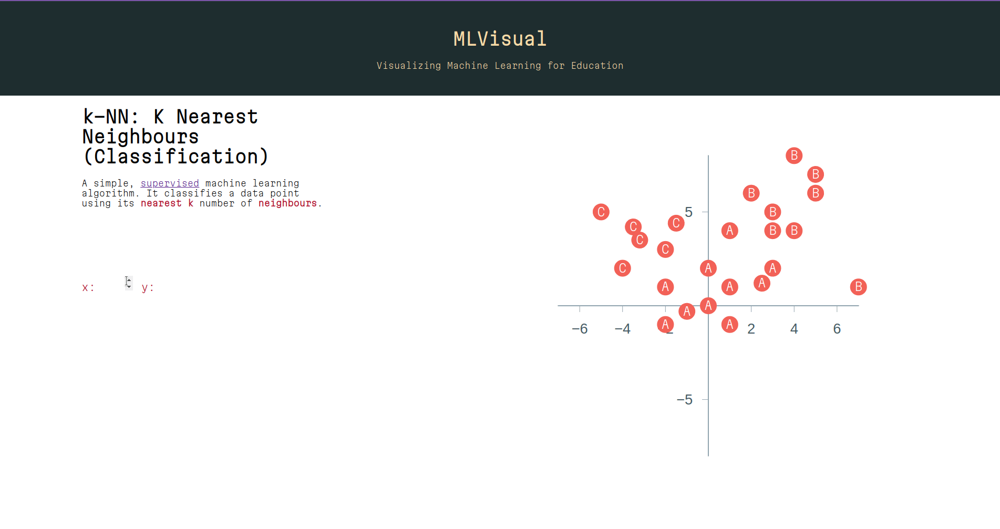

# MLVisual

## Dependencies

- [Victory](https://www.npmjs.com/package/victory)

## Description

Simple educational tool used to understand machine learning algorithms by vizualizing and interacting with them.

## Current Algorithms

### KNN (K-Nearest Neighbours) Classification

An interactive chart populated with already classified example "training" data. The user sets the co-ordinates of an unclassified point and the chart shows the k nearest neighbours and the classifcation of the user's point according to the algorithm.

